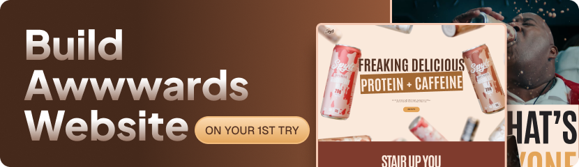

# SPYLT GSAP Landing Page

A high-motion product landing page built with React, GSAP, and Tailwind CSS v4.

This project showcases a premium beverage-style marketing experience with scroll-driven storytelling, pinned sections, animated typography, flavor sliders, and video-rich testimonials.



## Live Experience

The app is designed as a single-page visual narrative with these core sections:

- Hero intro with responsive media (video on desktop, image composition on smaller screens)
- Animated message reveal using split text and clip-path transitions
- Flavor showcase with stylized bottle/cards slider
- Nutrition block with animated title and responsive nutrient list
- Benefit section with staged title reveals and a pinned video component
- Testimonial section with pinned horizontal-feel motion and hover-play video cards
- Branded footer with social links and newsletter-style UI

## Tech Stack

- React 19
- Vite 7
- GSAP 3 (`ScrollTrigger`, `ScrollSmoother`, `SplitText`)
- `@gsap/react` for React-friendly animation lifecycle
- Tailwind CSS v4 (`@tailwindcss/vite` plugin)
- `react-responsive` for breakpoint-specific rendering
- ESLint 9 for linting

## Animation & Interaction Highlights

- Global smooth scrolling via `ScrollSmoother`
- Scroll-scrubbed section transforms and reveal timelines
- Character/word-level text animation with `SplitText`
- Clip-path based title reveals for cinematic section entrances
- Pinned storytelling sequences for benefits and testimonials
- Hover-driven testimonial video playback

## Project Structure

```text
gsap-project1/
├─ public/
│  ├─ fonts/
│  ├─ images/
│  └─ videos/
├─ src/
│  ├─ components/      # Reusable UI and motion components
│  ├─ constants/       # Flavor, nutrition, and testimonial content data
│  ├─ sections/        # Page-level narrative sections
│  ├─ App.jsx          # Section composition + global GSAP setup
│  ├─ index.css        # Tailwind + custom theme tokens + section styles
│  └─ main.jsx         # React entry point
├─ index.html
├─ vite.config.js
└─ package.json
```

## Getting Started

### 1. Install dependencies

```bash
npm install
```

### 2. Start development server

```bash
npm run dev
```

### 3. Build for production

```bash
npm run build
```

### 4. Preview production build locally

```bash
npm run preview
```

### 5. Run lint checks

```bash
npm run lint
```

## Scripts

- `npm run dev`: Launch Vite dev server with HMR
- `npm run build`: Generate optimized production bundle
- `npm run preview`: Serve production bundle locally
- `npm run lint`: Run ESLint across the project

## Design System Notes

Core visual tokens are defined in `src/index.css` using Tailwind v4 theme variables:

- Warm milk/brown palette for brand personality
- `Antonio` as headline font
- `ProximaNova` for paragraph/body text
- Shared utility/component classes for consistent layout and typography behavior

## Assets

All static resources are stored in `public/`:

- Product and UI graphics in `public/images`
- Motion media in `public/videos`
- Custom typeface in `public/fonts`

## Performance Considerations

- Media switches by viewport for better mobile experience
- Scroll timelines are section-scoped via `useGSAP`
- Most animations rely on transform/opacity/clip-path, which are generally GPU-friendly

## Deployment

The app is Vite-based and can be deployed to any static hosting platform:

- Vercel
- Netlify
- GitHub Pages
- Cloudflare Pages

Build output is generated in the `dist/` directory after running `npm run build`.

## Acknowledgements

- Inspired by modern beverage/product storytelling websites
- Built with the GSAP ecosystem and React component architecture
